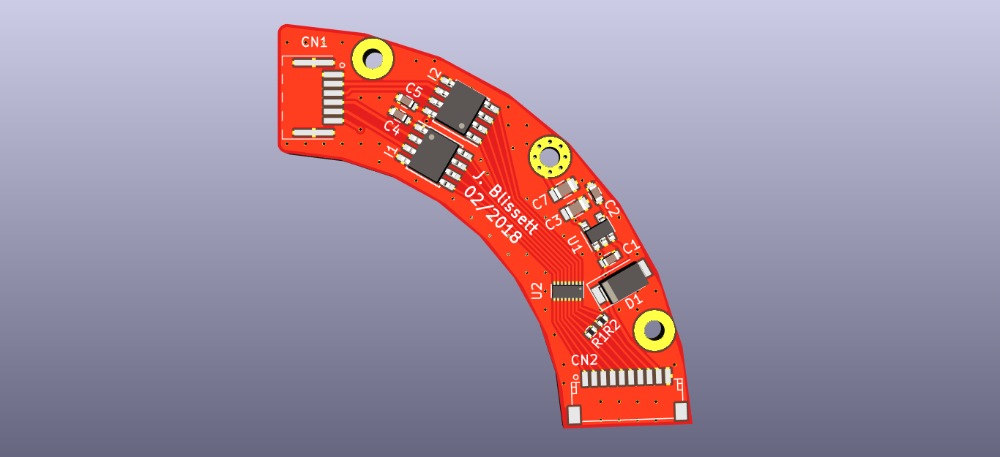

# renishaw-aksim-adapters

This repository includes adapters to convert the [Renishaw Aksim 
series](http://www.directindustry.com/prod/renishaw/product-5200-1654055.html)
encoders for different signalling methods. 

The adapters are designed to be the same form factor as the encoder itself, so they can be placed in the same 
housing alongside the encoder.

## /differential

## /analogue

Will be an adapter to imitate sin-cos encoder or resolver - only schematic concept at present.

Designed using KiCad version 2018-01-25 revision 89a5a84af.

Released under GNU GPL v3.0 licence.
